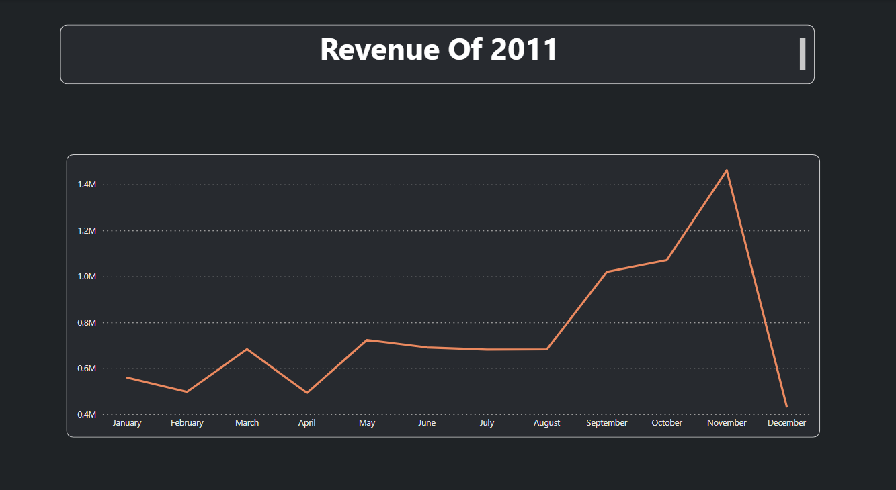

# Tata Data Visualization: Empowering Business with Effective Insights

## Project Overview

During a job simulation with Tata Consultancy Services (TCS) in April 2024, I focused on leveraging data visualization techniques to provide actionable insights and support strategic decision-making for business executives.

### Key Tasks:

- **Data Visualization Creation:** Developed interactive data visualizations using Power BI to represent complex datasets and trends.
- **Client Engagement:** Prepared and presented insightful questions to TCS senior leadership, aligning visualization strategies with business objectives.
- **Decision Support:** Utilized visual data analysis to empower executives with the information needed for effective decision-making.

## How to Use

1. Clone this repository to your local machine using `git clone`.
2. Open the Power BI files using Power BI Desktop to interact with the visualizations and explore the data insights.

## Technologies Used

- Power BI: For data visualization and analysis.

## About the Project

This project demonstrates skills in data visualization, client communication, and strategic decision support. It serves as a showcase of my ability to translate data into actionable insights that drive business success.

## Question asked by CMO and CEO

- Question 1
The CEO of the retail store is interested to view the time series of the revenue data for the year 2011 only. He would like to view granular data by looking into revenue for each month. The CEO is interested in viewing the seasonal trends and wants to dig deeper into why these trends occur. This analysis will be helpful for the CEO to forecast for the next year.

- Question 2
The CMO is interested in viewing the top 10 countries which are generating the highest revenue. Additionally, the CMO is also interested in viewing the quantity sold along with the revenue generated. The CMO does not want to have the United Kingdom in this visual.

- Question 3
The CMO of the online retail store wants to view the information on the top 10 customers by revenue. He is interested in a visual that shows the greatest revenue generating customer at the start and gradually declines to the lower revenue generating customers. The CMO wants to target the higher revenue generating customers and ensure that they remain satisfied with their products.

-Question 4
The CEO is looking to gain insights on the demand for their products. He wants to look at all countries and see which regions have the greatest demand for their products. Once the CEO gets an idea of the regions that have high demand, he will initiate an expansion strategy which will allow the company to target these areas and generate more business from these regions. He wants to view the entire data on a single view without the need to scroll or hover over the data points to identify the demand. There is no need to show data for the United Kingdom as the CEO is more interested in viewing the countries that have expansion opportunities.

